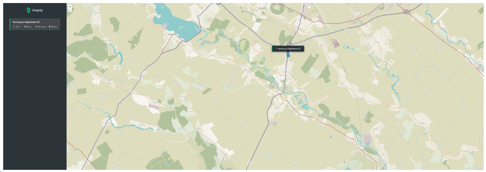

# Mapty

[](#)
> A dynamic and visually appealing restaurant menu that allows users to browse food items with filters and detailed images for each dish. The design ensures a clean user experience, making it easy for customers to find their desired meals.

## Overview

**Mapty** is a web application that allows users to log and track their workouts directly on an interactive map. By using geolocation, users can record the location of their runs or cycling sessions, along with details such as distance, duration, and pace or speed. This app provides a clear visual representation of workouts, making it easy to monitor progress over time.

## Preview

<p align="center">
  
</p>

## Features

- **Geolocation Tracking:** Automatically detect your location to log workouts.  
- **Interactive Map:** View workouts on a map using visual markers.  
- **Workout Logging:** Add details such as distance, duration, pace, and speed.  
- **Workout Types:** Choose between running and cycling workouts.  
- **Persistent Data:** All workouts are saved locally and remain after refreshing the page.  
- **Clean and Organized UI:** Easy-to-use interface for tracking activities.

## Live Demo

**Explore the live version here:** [View Live Demo](https://marius-maps.netlify.app/)

## Local Setup

1. **Clone** the repository:
   ```bash
   git clone https://github.com/MIBogdan/marius-maps.git
   ```
2. **Open** the `index.html` file in your browser
   *- or use a local development server (like VS Code Live Server) for a smoother development experience.*

---

## Author

**Marius Bogdan**  
[Personal portfolio](https://marius-bogdan.com/)

Feel free to reach out for any questions or collaborations!

## License

This project is provided for testing and demonstration purposes only. All rights are reserved. No part of this project may be redistributed, reuploaded, or used in any manner (commercially or otherwise) without explicit written permission from the author.
